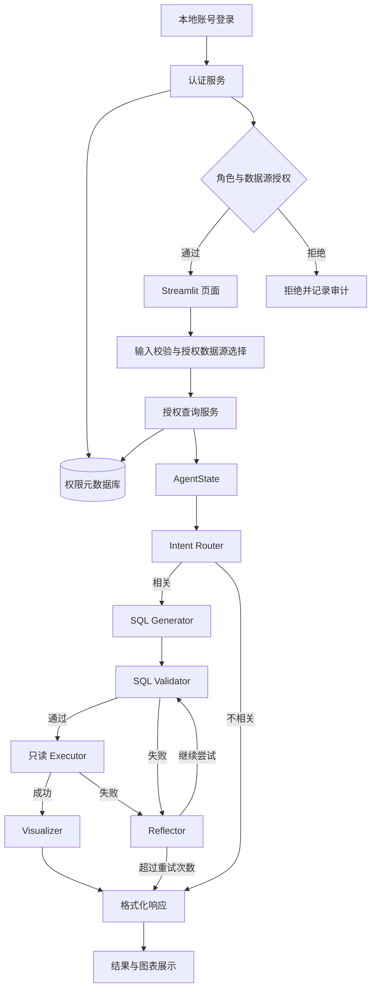

# ChatBI 智能数据分析平台

这是一个基于 LangGraph 和 LangChain 的自然语言数据分析平台，支持阿里云通义千问（Qwen）、DeepSeek、OpenAI、Google Gemini 和 Anthropic Claude。平台内置本地账号登录、三类角色、数据源级授权和审计日志。登录用户可以直接用自然语言提问，系统会判断问题是否与当前数据库相关，生成并校验只读 SQL，执行查询，推荐图表，并返回分析结论。

核心设计思路：让大模型负责理解和推理，让程序负责身份认证、权限校验、安全执行和结果兜底。

## 一、平台解决什么问题

```text
自然语言问题
  → 判断问题是否与当前数据相关
  → 读取数据库结构和业务语义
  → 生成 SQLite SQL
  → 安全校验、语法校验和结果限制
  → 执行只读查询
  → 推荐图表并生成中文结论
```

## 二、主要能力

- **Agent 工作流**：使用 LangGraph 编排多个节点，并根据状态进行分支。
- **自然语言转 SQL**：根据问题和带有字段描述的数据库语义 Schema 生成 SQLite SQL。
- **语义 Schema**：补充表和字段的业务描述，帮助模型理解数据含义。
- **安全查询**：只允许只读查询，拦截 `DROP`、`DELETE`、`UPDATE`、`INSERT` 等危险操作。
- **SQL 校验**：校验表名和语法，并自动增加最大结果行数限制。
- **自动纠错**：SQL 校验或执行失败时，使用反思节点修正 SQL，最多重试 3 次。
- **多模型供应商**：四个 Agent 角色可以分别配置主模型和备用模型，供应商发生瞬态故障时按配置顺序切换。
- **智能可视化**：推荐柱状图、折线图、饼图、散点图或热力图。
- **单页可视化大屏**：智能问数结果可一键保存并加入当前账号的大屏。
- **原地编辑布局**：空格加号添加、拖动换位、右键删除、点击边缘继续分割。
- **受控自由分块**：默认使用 4 格、2 格、1 格布局，按最小尺寸阻止过度分割。
- **五分钟准实时更新**：大屏刷新前先增量同步远程数据库快照，再重新执行保存的只读查询。
- **确定性兜底**：图表配置不完整时，根据结果字段自动选择默认图表。
- **多数据源支持**：支持通过 MySQL/PostgreSQL 连接添加客户数据库分析快照。
- **Excel 数据源**：支持上传 `.xlsx`/`.xlsm`，自动将工作表识别为数据表、推断字段类型，并创建独立的 SQLite 分析副本。
- **本地账号登录**：密码使用 Argon2id 加盐哈希，支持首次改密、失败锁定、会话超时和退出。
- **RBAC 权限控制**：内置查询用户、数据管理员、系统管理员三种账号类型。
- **数据源授权**：普通账号只能看到并查询管理员明确授权的数据源。
- **管理员界面**：支持新增、启用/禁用、修改角色、重置密码和分配数据源。
- **审计日志**：记录登录、查询、导入、删除和权限变更；敏感凭据自动脱敏。
- **可观测性**：可选接入 LangSmith，追踪请求、模型调用和错误。

## 三、系统架构



| 模块 | 主要职责 | 关键文件 |
|---|---|---|
| 页面层 | 数据源选择、问题输入、结果展示和图表渲染 | `main.py` |
| 大屏界面层 | 双向交互画布、图表展示、拖动、删除和分割 | `dashboard_ui.py`、`dashboard_component/` |
| 大屏服务层 | 保存查询、布局校验、权限边界和持久化 | `application/dashboard_service.py` |
| 认证与权限层 | 本地登录、角色权限、用户管理、数据源授权和审计 | `auth/` |
| 应用服务层 | 在进入 Agent 前执行不可绕过的查询授权和审计 | `application/query_service.py` |
| 状态层 | 保存一次请求在节点之间传递的全部信息 | `agents/state.py` |
| 流程层 | 定义节点顺序、分支、重试和结束条件 | `agents/graph.py` |
| Agent 节点层 | 路由、SQL 生成、校验、执行、反思和可视化 | `agents/nodes.py` |
| 数据源层 | 管理本地、上传和远程数据库快照 | `infrastructure/data_sources.py` |
| 数据库层 | 读取 Schema、补充业务语义、执行只读 SQL | `infrastructure/db_manager.py` |
| 模型层 | 创建并缓存各 Agent 角色的主模型与备用模型 | `infrastructure/llm.py` |
| Prompt 层 | 定义分类、SQL 生成、错误修正和图表提示词 | `infrastructure/prompts.py` |
| 配置与校验层 | 管理配置、输入结果校验和追踪 | `config.py`、`validators.py`、`langsmith_config.py` |

## 四、一次请求的处理流程

1. 登录表单把用户名和密码交给 `AuthService` 校验，页面会话只保存用户 ID 和会话版本。
2. 每次 Streamlit 重新运行时，都从权限元数据库重读账号状态、角色和授权。
3. 页面只列出当前用户可见的数据源；用户选择数据源并输入问题。
4. `AuthorizedQueryService` 再次校验 `query_data` 和数据源授权。
5. `main.py` 校验问题内容，`graph.py` 初始化 `AgentState`。
6. Intent Router 判断问题是否可由当前数据库回答。
7. SQL Generator 获取带有字段描述和主键信息的语义 Schema，生成 SQL。
8. SQL Validator 检查危险关键字、表名、SQL 语法，并补充 `LIMIT`。
9. Executor 通过受控目录中的只读 SQLite 连接执行 SQL。
10. 如果校验或执行失败，Reflector 修正 SQL 后重新校验。
11. 查询成功后，Visualizer 根据真实结果推荐图表。
12. 返回页面前再次确认账号和数据源授权，并记录审计事件。
13. 用户可以点击“添加到可视化大屏”，系统保存已验证 SQL 和图表配置并填入首个空格。
14. 大屏每五分钟先同步远程快照，再重新执行保存的只读查询；进入编辑后可直接在画布内调整并保存布局。

## 五、可视化大屏

登录后的工作台顶部只有“智能问数”和“可视化大屏”两个一级页面。
每个账号拥有一张独立大屏，且只能使用自己有权访问的数据源：

1. 在智能问数中生成一个成功的查询结果；
2. 点击“添加到可视化大屏”，将查询保存到组件库并自动填入首个空格；
3. 进入可视化大屏，点击“编辑”后直接操作画布；
4. 空格点击“＋”选择已保存查询；按住图表标题拖动可换位，右键可删除；
5. 点击格子边缘进行上下或左右分割，达到最小尺寸后不再显示对应分割入口；
6. “保存”旁的“撤回”可连续恢复最近 50 次添加、删除、拖动、分割及尺寸调整；
7. 点击“保存”发布当前布局，浏览状态下每五分钟先同步远程快照再更新图表。

## 六、目录结构

```text
chatbi 示例/
├── main.py                         # Streamlit 页面和结果展示
├── scripts/
│   └── manage_auth.py              # 本机初始化首个管理员
├── requirements.txt                # Python 依赖
├── setup.py                        # 项目安装配置
├── .env.example                    # 环境变量示例
├── application/
│   ├── dashboard_service.py        # 大屏查询库、布局树和持久化
│   └── query_service.py            # 授权后的查询入口
├── dashboard_component/            # 大屏双向前端组件及本地 Plotly 资源
├── dashboard_ui.py                 # 大屏页面、五分钟刷新和组件选择
├── auth/
│   ├── constants.py                # 角色和权限点
│   ├── database.py                 # 权限元数据库 Schema
│   ├── models.py                   # 用户、数据源和审计模型
│   ├── passwords.py                # Argon2id 密码服务
│   ├── service.py                  # 认证、RBAC、授权与审计规则
│   └── ui.py                       # 登录、用户管理和审计页面
├── data/
│   ├── uploads/                    # 客户业务分析副本（不提交到 Git）
│   └── system/
│       └── chatbi_meta.db          # 本地权限元数据库（不提交到 Git）
├── infrastructure/
│   ├── config.py                   # 配置管理和配置校验
│   ├── llm.py                      # 多供应商模型初始化、缓存与故障切换
│   ├── prompts.py                  # 系统提示词和示例
│   ├── db_manager.py               # 数据库访问和语义 Schema
│   ├── data_sources.py             # 数据源管理
│   ├── validators.py               # 输入和查询结果校验
│   └── langsmith_config.py         # LangSmith 追踪配置
├── agents/
│   ├── state.py                    # AgentState 状态定义
│   ├── nodes.py                    # Agent 节点实现
│   └── graph.py                    # LangGraph 工作流构建和执行
├── docs/                           # 架构、演示和企业场景说明
└── test/                           # 自动化测试
```

## 七、快速开始

### 环境要求

- Python 3.10 或更高版本
- 至少一个受支持模型平台的 API Key

### 安装与启动

```bash
cd "chatbi 示例"
pip install -r requirements.txt
cp .env.example .env
python scripts/manage_auth.py init-admin
streamlit run main.py
```

编辑 `.env`，设置 `LLM_PROVIDER` 并配置对应平台的 API Key；默认配置继续使用 Qwen 和 `DASHSCOPE_API_KEY`。`init-admin` 会在本机终端安全提示输入管理员密码，不会把密码写入命令历史。启动后访问 <http://localhost:8501>，使用刚创建的管理员登录，再从侧边栏“添加数据”入口连接客户数据库或上传 Excel，并创建演示账号。

## 八、示例问题

```text
统计 auto_test_table_1 中不同 status 的记录数量
按 device_id 统计 s_device_log 中的平均温度
展示 s_device_log 中温度随 collect_time 变化的趋势
```

企业演示问题和业务数据说明请参考 [ENTERPRISE_DEMO_GUIDE.md](docs/ENTERPRISE_DEMO_GUIDE.md)。

## 九、环境配置

```bash
LLM_PROVIDER=qwen

DASHSCOPE_API_KEY=sk-your-dashscope-api-key
DASHSCOPE_BASE_URL=https://dashscope.aliyuncs.com/compatible-mode/v1

DEEPSEEK_API_KEY=
DEEPSEEK_BASE_URL=https://api.deepseek.com

OPENAI_API_KEY=
OPENAI_BASE_URL=https://api.openai.com/v1

GOOGLE_API_KEY=
ANTHROPIC_API_KEY=
ANTHROPIC_BASE_URL=

# 未配置模型链时使用下面四个单模型变量，兼容原有 Qwen 部署。
ROUTER_MODEL=qwen-plus
SQL_GENERATOR_MODEL=qwen-plus
REFLECTOR_MODEL=qwen-plus
VISUALIZER_MODEL=qwen-plus

# 可选：为每个角色配置有序的 provider:model 故障切换链。
# 只有链中实际引用的平台才需要填写 Key。
ROUTER_MODEL_CHAIN=
SQL_GENERATOR_MODEL_CHAIN=
REFLECTOR_MODEL_CHAIN=
VISUALIZER_MODEL_CHAIN=

LLM_TEMPERATURE=0.0
LLM_TIMEOUT=60
LLM_MAX_RETRIES=2
LANGSMITH_API_KEY=

MAX_RETRY_COUNT=3
MAX_RESULT_ROWS=50
MAX_RESULT_BYTES=5242880
SQL_QUERY_TIMEOUT_SECONDS=15
MAX_SQL_QUERY_BYTES=100000
MAX_RESULT_COLUMNS=200
DATASOURCE_ALLOWED_HOSTS=localhost:3306,localhost:5432,127.0.0.1:3306,127.0.0.1:5432,[::1]:3306,[::1]:5432

CHATBI_META_DB_PATH=data/system/chatbi_meta.db
AUTH_SESSION_TIMEOUT_MINUTES=30
AUTH_MAX_FAILED_ATTEMPTS=5
AUTH_LOCKOUT_MINUTES=15
AUTH_MAX_CONCURRENT_PASSWORD_CHECKS=2
AUTH_AUDIT_MAX_ROWS=50000
AUTH_AUDIT_RETENTION_DAYS=180
```

例如，下面的配置会优先使用 Qwen，在超时、限流或服务端错误等瞬态故障后切换到 DeepSeek：

```bash
ROUTER_MODEL_CHAIN=qwen:qwen-plus,deepseek:deepseek-chat
SQL_GENERATOR_MODEL_CHAIN=qwen:qwen-plus,deepseek:deepseek-chat
REFLECTOR_MODEL_CHAIN=qwen:qwen-plus,deepseek:deepseek-chat
VISUALIZER_MODEL_CHAIN=qwen:qwen-plus,deepseek:deepseek-chat
```

若只使用一家非 Qwen 平台，也可以不配置模型链，只需同时修改默认供应商、对应 Key 和四个模型名：

```bash
LLM_PROVIDER=openai
OPENAI_API_KEY=sk-...
ROUTER_MODEL=<openai-model-id>
SQL_GENERATOR_MODEL=<openai-model-id>
REFLECTOR_MODEL=<openai-model-id>
VISUALIZER_MODEL=<openai-model-id>
```

支持的 provider 名称为 `qwen`、`deepseek`、`openai`、`gemini` 和 `anthropic`；`claude` 可作为 `anthropic` 的别名。模型名称不会硬编码在程序中，应填写账号和区域当前可用的模型 ID。远程自定义模型端点必须使用 HTTPS，仅本机 `localhost` 或 loopback IP 允许 HTTP。未配置新的 `*_MODEL_CHAIN` 时，原有 `DASHSCOPE_API_KEY` 和 `*_MODEL` 配置保持原行为。配置和模型客户端在进程内缓存，修改 `.env` 后需要重启应用。

## 十、账号与权限管理

### 三种账号类型

| 账号类型 | 查询授权数据源 | 导入数据源 | 删除数据源 | 用户与授权管理 | 查看审计 |
|---|---:|---:|---:|---:|---:|
| 查询用户 `viewer` | ✅ | ❌ | ❌ | ❌ | ❌ |
| 数据管理员 `data_manager` | ✅ | ✅ | ❌ | ❌ | ❌ |
| 系统管理员 `admin` | ✅，自动访问全部 | ✅ | ✅ | ✅ | ✅ |

代码实际按照权限点判断，而不是仅判断角色名称。系统权限点包括：

```text
query_data
import_datasource
delete_datasource
manage_users
manage_datasource_access
view_audit_logs
```

### 权限元数据库

账号信息只保存一次，全部位于独立的 `data/system/chatbi_meta.db`，不会写入客户业务快照。核心表如下：

| 表 | 内容 |
|---|---|
| `users` | 用户名、显示名称、邮箱、Argon2id 密码哈希、状态、锁定和会话版本 |
| `roles` / `permissions` | 三类系统角色和原子权限点 |
| `user_roles` / `role_permissions` | 用户、角色和权限的关联 |
| `datasources` | 稳定数据源 ID、受控存储名、状态和版本 |
| `datasource_permissions` | 普通用户可以访问哪些数据源 |
| `audit_logs` | 登录、查询、导入、删除和管理操作的结果 |

元数据库会启用外键、WAL 和等待超时，并尽量把文件权限设置为仅当前系统用户可读写。部署和备份时，应把它与 `data/uploads/` 中的业务快照分开处理。

业务快照目录会设置为 `0700`，元数据库和 SQLite 快照会设置为
`0600`。查询执行层会统一限制返回行数、近似结果字节数和执行时间，
即使生成的 SQL 自带更大的 `LIMIT` 也不能绕过上限。

`DATASOURCE_ALLOWED_HOSTS` 控制数据管理员可连接的 MySQL/PostgreSQL
服务器，默认仅允许本机的 MySQL/PostgreSQL 标准端口。可以填写逗号
分隔的 `主机:端口`、`IP:端口` 或 `*.example.internal:3306`；系统会
解析一次地址并拒绝 link-local、保留、多播和未指定地址。只有在完全
可信的演示网络中才应设为 `*`。正式环境还应在防火墙或容器网络层
限制应用的出站访问。

### 管理员操作流程

1. 首次部署在服务器本机运行 `python scripts/manage_auth.py init-admin`。
2. 使用管理员账号登录，进入侧边栏“用户管理”。
3. 创建 `viewer`、`data_manager` 或 `admin` 账号，并设置临时密码。
4. 为非管理员选择允许访问的数据源。
5. 新用户首次登录时必须修改临时密码。
6. 管理员以后可以禁用/启用账号、修改角色、重置密码或立即收回数据源授权。

系统不会内置通用演示密码，也不允许网页上的首位访问者创建管理员。最后一个有效管理员不能被禁用或降级。角色、账号状态、密码重置或数据源授权发生变化时，受影响账号的旧会话会立即失效。

## 十一、数据库和数据源

平台启动时不加载任何预置数据库。拥有 `import_datasource` 权限的账号可以点击侧边栏数据目录中的“＋”按钮，连接 MySQL 或 PostgreSQL；添加成功后，平台才会启用提问和分析。查询用户看不到导入和删除入口。

平台会先把客户选择的远程数据库复制成私有的隔离快照，完成校验后再与权限登记一起原子发布到 `data/uploads/`。删除时也会先原子移入隔离区；元数据库提交失败会自动恢复文件。查询流程只接受登记且已授权的数据源，并排除内部的 `_chatbi_*` 元数据表。快照大小上限为 100 MB，远程数据库密码只保存在当前 Streamlit 会话中，不会写入项目文件或审计日志。系统管理员可以刷新或删除现有快照；数据管理员不能覆盖其他用户登记的快照。

新添加的远程快照会为每张表自动选择同步策略：有单列主键和 `updated_at`/同类时间字段时执行增量 upsert；只有自增主键时执行追加同步；无可靠游标时对该表执行全量校准。同步操作在临时副本中完成，校验后才原子替换快照；失败时大屏继续显示最近成功数据。旧版快照需要重新添加一次才会生成同步游标。默认间隔为 300 秒，可通过 `DASHBOARD_REFRESH_SECONDS` 配置为 30–3600 秒。

数据库语义层会读取表和字段描述、主键信息以及远程字段注释，帮助模型理解字段含义。

## 十二、安全和可靠性设计

- 密码使用 Argon2id 随机盐哈希，不保存或记录明文。
- 登录连续失败默认 5 次后锁定 15 分钟；Argon2 校验设有并发上限，
  不会在高成本哈希期间占用元数据库写锁；会话默认空闲 30 分钟后失效。
- 每次页面运行重新检查账号状态和会话版本，退出时清理查询结果、数据源选择和远程连接凭据。
- 查询、Schema 展示、问题推荐、导入和删除都在实际操作前做服务端权限校验；隐藏按钮只是界面层辅助。
- 业务数据源只能解析到 `data/uploads/` 受控目录，不能通过路径参数读取任意 SQLite 文件。
- 使用只读数据库连接，避免生成 SQL 修改业务数据。
- 拦截 `DROP`、`DELETE`、`UPDATE`、`INSERT`、`ALTER`、`TRUNCATE`、`CREATE`、`REPLACE`、`ATTACH`、`DETACH`、`PRAGMA` 和 `VACUUM`。
- 执行前使用 `EXPLAIN QUERY PLAN` 检查 SQL 语法。
- 检查 SQL 引用的表是否存在。
- 在最终执行边界统一限制结果行数、近似结果字节数和 SQL 执行时间。
- 长查询返回前再次检查账号会话、数据源授权和数据源版本。
- 远程数据库连接受 `DATASOURCE_ALLOWED_HOSTS` 出站主机白名单约束。
- 对用户输入和查询结果进行校验。
- 图表配置无效时使用本地规则生成默认图表。
- SQL 失败时通过 Reflector 自动修正，但有最大重试次数限制。
- 审计详情使用白名单式结构并递归遮蔽密码、密钥、令牌和凭据字段；
  不保存查询结果或完整自然语言问题，并按配置的条数与天数自动保留。

当前版本的授权粒度是“功能权限 + 数据源级权限”，不包含表级、字段级或行级隔离。远程数据库复制采用平台连接账号能读取的内容，原数据库内部的细粒度权限不会自动迁移到快照。敏感客户环境应只同步授权视图或脱敏副本。

本地账号与 SQLite 元数据库适合单机演示、私有化试用和小规模单实例部署。面向正式公网或多实例生产环境，还应配置 HTTPS/反向代理、登录接口速率限制、审计归档与保留策略、受控网络入口、集中密钥管理和备份，并按客户要求迁移到企业 OIDC/SSO 与 PostgreSQL 权限库。

语义 Schema 和查询结果会按现有 Agent 流程发送给相应角色配置的模型服务；启用 LangSmith 时还可能产生追踪数据。模型故障切换可能把同一请求发送给备用供应商，因此正式部署必须由管理员明确批准每条模型链，并结合客户的数据出境、地域和隐私要求选择供应商。

## 十三、测试

```bash
# 离线认证、RBAC、数据源授权和审计测试（不调用大模型）
python -m unittest -v test/test_auth.py

# Streamlit 登录后角色页面与按钮可见性测试（不调用大模型）
python -m unittest -v test/test_auth_ui.py

# SQL 行数/字节上限、只读规则和远程主机白名单测试
python -m unittest -v test/test_database_guardrails.py

# 多供应商配置、故障切换和响应兼容测试
python -m unittest -v test/test_llm_providers.py

# Pydantic 状态测试
python test/test_pydantic_state.py

# 系统测试，需要有效 API Key，且数据目录中至少有一个已添加数据库
python test/test_system.py
```

## 十四、建议的代码阅读顺序

1. `main.py` 的 `main()`：理解登录总闸门、页面导航和查询入口。
2. `auth/constants.py`、`auth/database.py`：理解角色权限和元数据库。
3. `auth/service.py`：理解认证、账号管理、数据源授权和审计规则。
4. `application/query_service.py`：理解权限如何包住 Agent 查询。
5. `agents/state.py`、`agents/graph.py`：理解请求状态、节点顺序和重试。
6. `agents/nodes.py`：逐个理解每个节点的职责。
7. `infrastructure/db_manager.py`：理解 Schema、语义层和 SQL 执行。
8. `infrastructure/data_sources.py`：理解远程数据库如何变成本地快照。
9. `prompts.py`、`llm.py` 和 `config.py`：最后理解模型和配置细节。

## 十五、依赖组件

- **LangGraph**：编排带条件分支和重试的 Agent 工作流。
- **LangChain**：通过统一接口连接 Qwen、DeepSeek、OpenAI、Gemini 和 Claude。
- **模型平台**：Qwen、DeepSeek 和 OpenAI 使用 OpenAI 风格接口，Gemini 和 Claude 使用各自的 LangChain 适配器。
- **Pydantic**：定义和校验 Agent 状态及应用配置。
- **argon2-cffi**：提供 Argon2id 密码哈希和安全校验。
- **Streamlit**：提供交互式 Web 页面。
- **SQLite**：分别承载权限元数据库和本地只读业务分析快照。
- **Plotly**：生成交互式图表。
